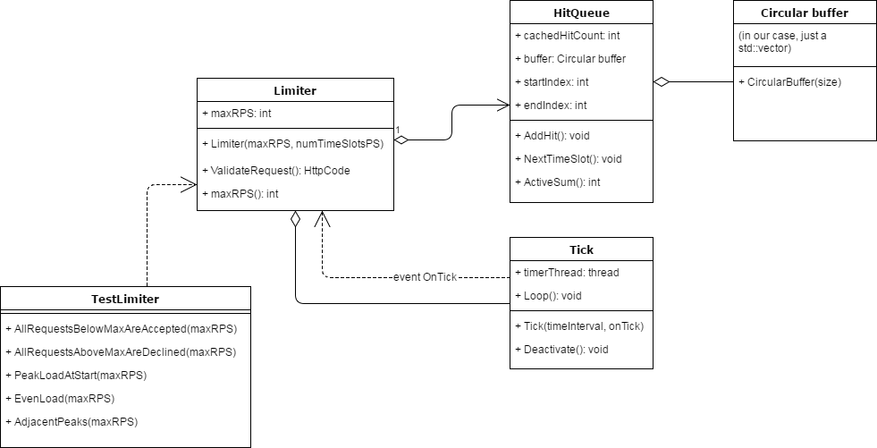

# Simple rate limiter

This repository contains a C++ implementation of a very primitive rate limiter.

# Dependencies

Only Standard C++ library. No boost or any third parties.
The code does not depend on any platform specifics, but was developed and tested only with MSVC on Windows.
The build outcome is a console application that will run the tests for the limiter. Simply clone, compile and run.
C++14 compiler is required (e.g. Visual Studio >= 2015).

# Algorithm

The basic idea takes into account the following thoughts:

+ To decide if the incoming request should be accepted/rejected we need to *somehow* keep the actual sum of hits/requests, which implies:
  * incrementing it as the valid request comes
  * decrementing it as the clock ticks
+ This may lead to the incorrect solution, when we simply calculate the sum per second.
+ But, **what if we just keep sum counts per finer time intervals**?

Hence, here's the plan.

+ Let's say we split 1-second interval into N time frames.
+ For each of them we will store the number of requests within that time frame in the corresponding element of the circular buffer.
+ As the time goes, we will be moving our "sliding window" in that buffer, so for each step
  * we append one time frame with count = 0 to the right
  * we throw away the left-most element of the buffer
+ Every such step happens per timer tick, which is emitted every 1/N seconds.

Here's the illustration.

# Implementation

# What can be improved here

TL;DR: A lot.
This is merely a "proof-of-concept" implementation made in a "quick-and-dirty" manner.

Some specific things to do:

+ Turn this console application into the static/dynamic library
+ Move tests to the separate library/application
+ Use some of the existing testing frameworks in that library/applicaton
  + e.g. Catch/Googletest/Boost.Test/doctest/whatever
+ (Arguable) use [Boost.Circular buffer](http://www.boost.org/doc/libs/1_64_0/doc/html/circular_buffer.html) instead of the self-implemented inside the class HitQueue
+ Abstract away the interface of Limiter via either abstract base class or template trait class
  + Also de-couple the tests from the specific impelemntation of Limiter
+ Add several other implementations, especially for the standard rate limiting algorithms
  + [Token bucket](https://en.m.wikipedia.org/wiki/Token_bucket)
  + [Leaky bucket](https://en.m.wikipedia.org/wiki/Leaky_bucket)
    + [as a meter](https://en.m.wikipedia.org/wiki/Leaky_bucket#The_Leaky_Bucket_Algorithm_as_a_Meter)
    + [as a queue](https://en.m.wikipedia.org/wiki/Leaky_bucket#The_Leaky_Bucket_Algorithm_as_a_Queue)